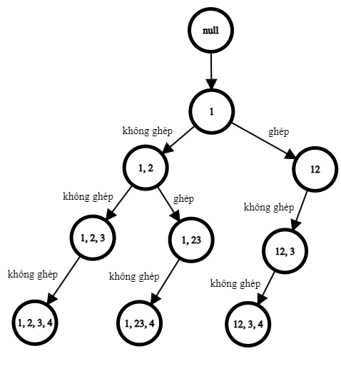

# Intuition
<!-- First thoughts on how to solve this problem -->
Với mỗi vị trí của $M$, ta có thể quyết định việc tách ra để mã hóa riêng, hoặc ghép với vị trí tiếp theo rồi mới mã hóa (nếu như việc ghép này thỏa mãn giá trị sau khi ghép <= "26"). 

Ví dụ với $M = "1234"$ có thể biểu diễn bài toán dưới dạng cây như sau:



Khi đó số cách giải mã sẽ bằng đúng **số node lá** của cây bên trên ($"1, 2, 3, 4", "1, 23, 4", "12, 3, 4"$ là 3 cách mã hóa hợp lệ cho $M = "1234"$). 
 
# Approach
<!-- Approach to solve the problem -->
Về cơ bản chúng ta có thể đếm được hết các trạng thái có thể mã hóa của bản tin $M$ nếu generate hết tất cả các trạng thái ra (giống như generate ra cây như hình ở trên). Độ phức tạp khi đó sẽ là $O(2^n)$ do tại mỗi vị trí, ta có thể chọn giữa việc ghép hoặc không ghép, nên trong trường hợp xấu nhất, gần như tất cả các nút đều có 2 nút con (ví dụ như $M = "11111111111...."$).

Để giảm độ phức tạp, ta có thể sử dụng quy hoạch động để tránh việc tính toán lại không cần thiết. Dễ thấy, các nút **có cùng xâu cuối được mã hóa ở cùng vị trí** sẽ có cùng đáp án. Ví dụ như nút $"1, 2, 3"$ và $"12, 3"$ ở hình trên (có cùng xâu mã hóa ở cuối là $"3"$), hai nút này đều có cùng số lượng cách mã hóa do đều xét việc ghép hoặc không ghép ở xâu $"3"$.

Gọi $dp_i$ là số cách mã hóa của $M$ nếu $i$ là vị trí cuối. Xét 2 trường hợp:
- Không ghép kí tự hiện tại với kí tự tiếp theo: $dp_i$ += $dp_{i + 1}$
- Ghép kí tự hiện tại với kí tự tiếp theo, nếu như việc ghép là hợp lệ (giá trị sau khi ghép phải <= 26): $dp_i$ += $dp_{i + 2}$
# Complexity
- Time complexity: O(n)
- Space complexity: O(n)

# Code
``` c++
#include <bits/stdc++.h>
using namespace std;

typedef long long ll;

const ll mod = 1e9 + 7;

int main()
{

#ifndef ONLINE_JUDGE
    freopen("in.txt", "r", stdin);
    freopen("out.txt", "w", stdout);
#endif

    ios_base::sync_with_stdio(false);
    cin.tie(0);

    int t;
    cin >> t;

    while (t--)
    {
		string s;
		cin >> s;
		int n = s.length();
		vector<int> dp(n + 1);
		dp[n] = 1;
		dp[n - 1] = s[n - 1] != '0' ? 1 : 0;
		for(int i = n - 2; i >= 0; --i){
            // '0' không thể đứng riêng cũng không thể ghép với kí tự tiếp theo 
			if(s[i] == '0'){
				dp[i] = 0;
				continue;
			}
            // Không ghép với kí tự tiếp theo
			dp[i] += dp[i + 1];
            // Ghép với kí tự tiếp theo, kiểm tra xem sau khi ghép thì giá trị có hợp lệ không (<= 26)
			if(s[i] == '1' || s[i] == '2' && s[i + 1] <= '6' && s[i + 1] >= '0'){
				dp[i] += dp[i + 2];
			}
		}

		cout << dp[0] << '\n';
    }
    return 0;
}
```